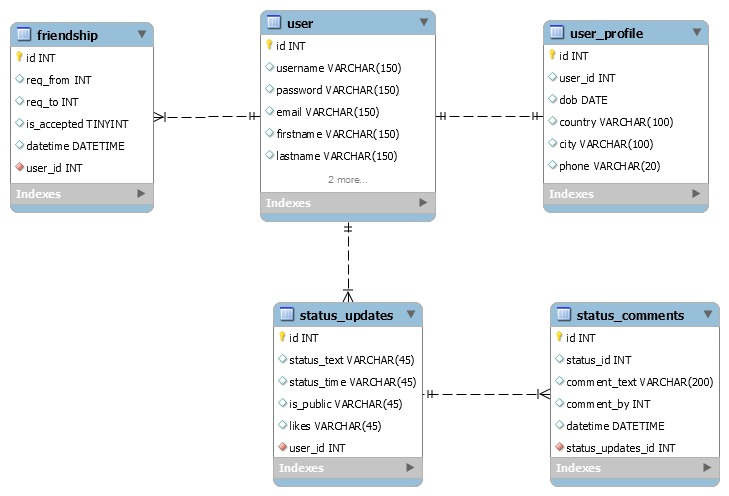

**Welcome to the home of your group's BWA course project code and documentation!**

This file is where your group writes your project plan/project report.

When you write it, you must use Markdown. [Documentation for GitLab Flavored Markdown (GFM)](https://docs.gitlab.com/ee/user/markdown.html).

# Initial project plan document
The headers that must be present in this document are shown here. They were copied here from the course project assignment document.

For instructions on what to add under these headers, see the course project assignment document, [Appendix 2: Initial project plan document](https://docs.google.com/document/d/1iJ4z8dQzUWht0ABX18RXa5Rp8hY76vcMJvBbxODs3PE/edit?usp=sharing#heading=h.m6xhgmo8x8lz)

## Course project group information
### Project Name: [Let Connect](https://let-connect.herokuapp.com/)
| Student Name | Student Number |
| -------- | -------- |
| Muhammad Zohaib Aslam   | 281690   |
| Usama Rafique   | 281800   |
| Morvan Nozahic   | 282964   |

## Must have features
- [x] Use a virtual environment
- [x] Validate all HTML & CSS
- [x] Set **debug = false** at final deployment
- [x] Description of the web service data and functionality
    - [x] **Users**
        - [x] Admin User
        - [x] Normal Users
    - [x] **User profile pages**
        - [x] Update profile information
        - [x] Show friends
        - [x] Show discussions
    - [x] **Friendship**
        - [x] Add new friend
        - [x] View friend requests
        - [x] Unfriend a friend
    - [x] **Discussions**
        - [x] Start a discussion
        - [x] Join a discussion
        - [x] Comments on discussion
- [x] GitLab issue board for handling tasks
- [x] Small and precise commit messages
- [x] Track project progress with time
- [x] Deploy site to heroku
    - [x] Deploy often to heorku during development

## Implemented +2 features

### One star features
- [x] Email validation on sign-up
- [x] Use separate Django apps for different parts of your project
- [x] Make users searchable, using Ajax

### Two Star features
- [x] Use PostgreSQL as database
- [x] Using Bootstrap for mobile friendliness
- [x] 3rd party login

## Pages and navigation
**Pages**
 + Login Page (Login using username and password, goto signup page or login with Facebook)
 + Signup Page (A signup confirmation link will be printed on console)
 + Profile Page (Home Page. Participated discussions, friends and friends requests are visible here)
 + Profile Info Page (Users info(private and public),Update or Delete Profile,friends,sent friend requests and discusions can be seen)
 + Update Profile (Edit profile info using this page)
 + Find Friends Page (Search friends with user name)
 + All Discussions Page (All open discussions are visible here)
 + Create Discussion Page (Initiate a new discussion here)
 + Participate in Discussion Page (Comment on an existing discussion)

## Technological considerations

### Django apps in your Django project
- [x] user app (Handles all User Profile functionality)
- [x] friendship app (Handles all Friend requests functionality)
- [x] discussions app (Handles all Discussions functionlaity)

### Needed Django models and their attributes
Here's our Entity Relationship Diagram for models:

**These models are not finalized. It will be updated as we add more features**

### URIs
- [x] https://let-connect.herokuapp.com/login
- [x] http://let-connect.herokuapp.com/user/signup
- [x] http://let-connect.herokuapp.com/user/profile
- [x] http://let-connect.herokuapp.com/user/profile/info/3
- [x] http://let-connect.herokuapp.com/user/profile/edit
- [x] http://let-connect.herokuapp.com/friendship/find
- [x] http://let-connect.herokuapp.com/discussions/
- [x] http://let-connect.herokuapp.com/discussions/create
- [x] http://let-connect.herokuapp.com/discussions/view/1
- [x] https://let-connect.herokuapp.com/logout
### Needed Django views and templates
**Views**
 + login_user
 + logout_user
 + signup
 + account_activation_sent
 + activate
 + profile
 + profile_info
 + edit_profile
 + delete_account
 + find_friends
 + list_friends
 + friend_request
 + accept_request
 + unfriend
 + show_discussions
 + create_discussion
 + view_discussion
 + load_comments
 + new_comment

**Templates**
 + signup.html
 + login.html
 + profile_page.html
 + profile_info.html
 + edit_profile.html
 + account_activation_email.html
 + account_activation_sent.html
 + findfriend.html
 + friend_list.html
 + view.html
 + discussions.html
 + create.html
 + comments.html

### Heroku deployment
Deployment is already done on Heroku at following URL
**[Let Connect App for BWA028](https://let-connect.herokuapp.com/)**

## Test Users

**Admin Users**

| User Name | Password |
| --------  | -------- |
| zohaib-super | @@WebFix99!! |
| usama-super | Temp/123 |

**Normal users**

| User Name | Password |
| -------- | -------- |
| Morvan | Temp/123 |
| Usama | Temp/123 |
| zohaib | configure121 |
| Irfan | Temp/123 |
| Saad | Temp/123 |
| waqas | Temp/123 |
| Mehboob | Temp/123 |
| Sami | Temp/123 |
| Mikko | Temp/123 |
| Ali | Temp/123 |

## Project timetable and division of work

>>>
_`The Django project in this repo (bwa2018djangoproject), was created for the groups using Heroku Django Starter Template. The information about it left here for educational purposes. The groups are free to remove this text and all the text below it from this file.`_
# Heroku Django Starter Template

An utterly fantastic project starter template for Django 2.0.

## Features

- Production-ready configuration for Static Files, Database Settings, Gunicorn, etc.
- Enhancements to Django's static file serving functionality via WhiteNoise.
- Latest Python 3.6 runtime environment.

## How to Use

To use this project, follow these steps:

1. Create your working environment.
2. Install Django (`$ pipenv install django`)
3. Create a new project using this template

## Creating Your Project

Using this template to create a new Django app is easy::

    $ django-admin.py startproject --template=https://github.com/heroku/heroku-django-template/archive/master.zip --name=Procfile helloworld

(If this doesn't work on windows, replace `django-admin.py` with `django-admin`)

You can replace ``helloworld`` with your desired project name.

## Deployment to Heroku

    $ git init
    $ git add -A
    $ git commit -m "Initial commit"

    $ heroku create
    $ git push heroku master

    $ heroku run python manage.py migrate

See also, a [ready-made application](https://github.com/heroku/python-getting-started), ready to deploy.

## License: MIT

## Further Reading

- [Gunicorn](https://warehouse.python.org/project/gunicorn/)
- [WhiteNoise](https://warehouse.python.org/project/whitenoise/)
- [dj-database-url](https://warehouse.python.org/project/dj-database-url/)

>>>
